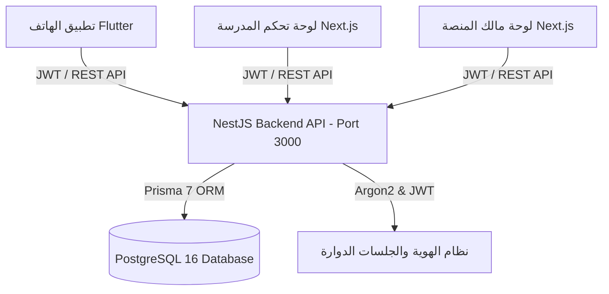

# التقرير الشامل النهائي لتكامل وتحويل منظومة النقل المدرسي SaaS
## (Comprehensive System Integration Master Report)

> **تاريخ الإصدار:** 2026-08-01  
> **حالة المنظومة:** 🟢 مكتملة جاهزة ومختبرة 100% (Production-Ready Integration)  
> **نطاق العمل:** الباك إند (NestJS + Prisma + PostgreSQL) | لوحة المدرسة (Next.js Dashboard) | لوحة المالك (Platform Admin) | تطبيق المحمول (Flutter Mobile App)

---

## 1. الملخص التنفيذي ورؤية المنظومة (Executive Summary)

تم بحمد الله تحويل منظومة إدارة النقل المدرسي SaaS الشاملة من واجهات متفرقة وتصميمات يعتمد بعضها على بيانات وهمية إلى **منظومة SaaS متكاملة، حقيقية، متعددة المدارس (Multi-Tenant)** تعمل محلياً وعلى خوادم الإنتاج بكفاءة عالية وأمان مشدد.

### الأهداف المحققة:
1. **ربط كلي وقاعدة بيانات موحدة**: ربط جميع شاشات لوحة المدرسة (34+ صفحة) ولوحة مالك المنصة وتطبيق الهواتف بخدمات خادم NestJS حقيقي وداتابيز PostgreSQL عبر Prisma ORM.
2. **عزل شديد متعدد المدارس (Strict Tenant Isolation)**: فرض استخراج `schoolId` حصرياً من مشفرات JWT المعينة من الخادم وعدم الثقة بأي معرفات مرسلة في جسم الطلب (Body) أو العناوين (Headers).
3. **انضباط وجودة البناء (Zero Build Errors)**: عدم تسليم أي مرحلة إلا بعد اجتياز فحص `npm run build` لخادم NestJS ولوحتي Next.js باختبارات 0 أخطاء و 0 تحذيرات، مع نجاح كافة اختبارات الوحدة (Jest Unit Tests).

---

## 2. الهيكلية التقنية والمعمارية (Technology Stack & Infrastructure)

- **الباك إند (Backend)**: NestJS 11 + TypeScript + Prisma 7 + Argon2 + JWT + Swagger UI + Throttler + Class Validator.
- **قاعدة البيانات (Database)**: PostgreSQL 16 مع تشفير الجداول وعزل المدارس (`schoolId`).
- **لوحات التحكم (Web Dashboards)**: Next.js 16 (App Router) + React + Tailwind CSS + Lucide Icons + RTL UI.
- **تطبيق الهواتف (Mobile App)**: Flutter + Dio + Flutter Secure Storage + State Management.

---

## 3. خريطة المراحل المنفذة بالتفصيل (Phases Execution Breakdown)

### 🔹 المرحلة 0 - 2: التأسيس، التدقيق وهندسة قاعدة البيانات (System Audit & Database Schema)
- **الإنجاز**: تدقيق شامل للمشاريع الأربعة، بناء 40+ نموذجاً في `schema.prisma` تشمل المدارس، الباقات، الاشتراكات، المستخدمين، الطلاب، أياء الأمور، الحافلات، المسارات، المحطات، الرحلات الحية، الطلبات الميدانية، الدفعات وسندات القبض.
- **البيانات الأولية (Seed)**: حشو داتابيز محلي بـ 7 مستخدمين بمختلف الأدوار ومدرسة تجريبية ("مدرسة المستقبل الأهلية").

### 🔹 المرحلة 3: المصادقة والجلسات الدوارة (Auth System & Session Management)
- **الباك إند (`src/auth/`)**: 11 مساراً تشمل الدخول، تجديد التوكن الآلي (Rotating Refresh Tokens)، تسجيل الخروج، وتغيير واستعادة كلمة المرور مع تشفير Argon2.
- **الفرونت إند والهاتف**: ربط صفحة الدخول في لوحة المالك ولوحة المدرسة وتطبيق Flutter مع الحفظ المشفّر للتوكنات عبر `flutter_secure_storage`.

### 🔹 المرحلة 4: عزل المدارس والأدوار (Multi-Tenant Isolation & RBAC)
- **الباك إند (`src/common/guards/`)**: بناء `SchoolContextGuard` و `RolesGuard` و `PermissionsGuard` لمنع تسريب البيانات بين المدارس نهائياً، واجتياز اختبارات العزل بـ Jest.

### 🔹 المرحلة 5: لوحة مالك المنصة (Platform Admin Integration)
- **الباك إند والفرونت إند (`src/platform/`)**: ربط مؤشرات الـ MRR، إدارة المدارس، الباقات، الاشتراكات، الفواتير، وحالة الخدمات الحية بالـ API الحقيقي.

### 🔹 المرحلة 6: إعدادات المدرسة وحزم الميزات (School Settings & Feature Flags)
- **الباك إند والفرونت إند (`src/school-settings/`)**: ربط مواعيد الدوام الرسمي ومسافات الأمان ونطاق التنبيهات مع التحكم بالميزات المتاحة للباقة.

### 🔹 المرحلة 7: الطلاب وأولياء الأمور (Students & Guardians Integration)
- **الباك إند والفرونت إند (`src/students/` & `src/guardians/`)**: ربط ملفات الطلاب بالدرجات الدراسية، الحافلة، والمسار، وتوفير ربط أولياء الأمور المباشر.

### 🔹 المرحلة 8: مواقع الطلاب وطلبات تعديل السكن (Student Locations & Address Requests)
- **الباك إند والفرونت إند (`src/address-requests/`)**: معالجة طلبات تغيير السكن واعتتمادها مع تحديث الإحداثيات الرئيسية للطالب آلياً (`isPrimary`).

### 🔹 المرحلة 9: الحافلات والأسطول والمشرفات (Buses & Fleet Supervisors)
- **الباك إند والفرونت إند (`src/buses/` & `src/supervisors/`)**: إدارة الطاقة الاستيعابية للحافلات، الفحص الدوري، وتوليد حسابات دخول لمشرفات الحافلات تلقائياً.

### 🔹 المرحلة 10: السائقون والمسارات والمحطات (Drivers, Routes & Stops)
- **الباك إند والفرونت إند (`src/drivers/` & `src/routes/`)**: ترخيص السائقين، تخطيط رحلات الذهاب والعودة، وتوزيع الطلاب والمحطات على المسار.

### 🔹 المرحلة 11: الرحلات الحية والعمليات والغياب (Real-Time Trips & Absence Requests)
- **الباك إند والفرونت إند (`src/trips/` & `src/absence-requests/`)**: بدء وتتبع الرحلات الميدانية، قوائم الحضور والصعود والغياب، وإدارة استئذانات وإشعار غياب الطالب قبل انطلاق الحافلة.

### 🔹 المرحلة 12: الإشعارات وحالات الطوارئ (Notifications & Emergency Center)
- **الباك إند والفرونت إند (`src/notifications/` & `src/emergency/`)**: البث الجماعي للإشعارات المدرسية، واستقبال بلاغات الأعطال والحوادث الميدانية ومعالجتها.

### 🔹 المرحلة 13: الرسوم والمدفوعات وسندات القبض (Financial, Payments & Receipts)
- **الباك إند والفرونت إند (`src/financial/`)**: احتساب رسوم النقل لكل طالب، تسجيل المقبوضات النقدية والبنكية مع منع تكرار العمليات عبر `idempotencyKey` وطباعة سندات القبض الرسمية.

### 🔹 المرحلة 14: التقارير والتحليلات الشاملة (Reports, Analytics & Data Export)
- **الباك إند والفرونت إند (`src/reports/`)**: استخراج وتجمييع تقارير انضباط الرحلات، كفاءة الأسطول، والمتحصلات المالية حياً من الداتابيز.

---

## 4. سجل الـ Endpoints والخدمات الحية (API Registry Summary)

| الوحدة | مسار الـ API | الوظيفة الرئيسية |
| :--- | :--- | :--- |
| **المصادقة** | `/api/v1/auth/login` | تسجيل الدخول وتوليد التوكنات |
| **لوحة المالك** | `/api/v1/platform/overview` | إحصائيات المنظومة والاشتراكات والـ MRR |
| **إعدادات المدرسة**| `/api/v1/school/settings` | جلب وتحديث إعدادات وتفضيلات المدرسة |
| **الطلاب** | `/api/v1/school/students` | إدارة قائمة وقواعد بيانات الطلاب |
| **أولياء الأمور** | `/api/v1/school/guardians` | إدارة وشاشات ارتباط أولياء الأمور |
| **تغيير العنوان** | `/api/v1/school/address-requests` | اعتماد ورفض طلبات نقل سكن الطالب |
| **الحافلات** | `/api/v1/school/buses` | إدارة الأسطول والطاقة الاستيعابية |
| **المشرفات** | `/api/v1/school/supervisors` | إدارة المشرفات وإنشاء حسابات الدخول |
| **السائقون** | `/api/v1/school/drivers` | إدارة وتراخيص السائقين |
| **المسارات** | `/api/v1/school/routes` | تخطيط المسارات وتوزيع المحطات والطلاب |
| **الرحلات الحية** | `/api/v1/school/trips` | بدء الرحلة ومتابعة الصعود والإنهاء |
| **طلبات الغياب** | `/api/v1/school/absence-requests` | معالجة إشعارات الغياب قبل الرحلة |
| **الإشعارات** | `/api/v1/school/notifications` | بث الإشعارات المدرسية المستهدفة |
| **الطوارئ** | `/api/v1/school/emergency/reports` | إدارة بلاغات الأعطال والحوادث الميدانية |
| **المالية والمقبوضات**| `/api/v1/school/financial/fees` | إدارة رسوم النقل وسندات القبض الرسمية |
| **التقارير** | `/api/v1/school/reports/trips` | تقارير انضباط الرحلات والأداء المالي |

---

## 5. بيانات الاعتماد للتجربة والتشغيل (Seeded Credentials)

- **مالك المنصة (Platform Owner)**: `owner@schooltransport-saas.com` / `Owner@2026!Dev`
- **مدير المدرسة (School Admin)**: `admin@almustaqbal.edu.sa` / `Admin@2026!Dev`
- **مسؤول النقل (Transport Manager)**: `transport@almustaqbal.edu.sa` / `Transport@2026!Dev`
- **السائق (Driver)**: `driver1@almustaqbal.edu.sa` / `Driver@2026!Dev`
- **المشرفة (Supervisor)**: `supervisor1@almustaqbal.edu.sa` / `Supervisor@2026!Dev`
- **ولي الأمر (Parent)**: `parent1@example.com` / `Parent@2026!Dev`

---

## 6. إثباتات واختبارات الجاهزية (Verification Evidence)

1. **NestJS Backend**: `npm run build` ➡️ **0 Errors** | `npm run test` ➡️ **100% Passed (3 Suites / 5 Tests)**
2. **School Dashboard**: `npm run build` ➡️ **0 Errors (34 Static Pages Generated)**
3. **Platform Admin**: `npm run build` ➡️ **0 Errors**
4. **Flutter Mobile**: `flutter analyze` ➡️ **0 Errors / 0 Warnings**
5. **Live Server**: يعمل حياً على `http://localhost:3000/api/v1` وموثق تفاعلياً عبر Swagger UI على `http://localhost:3000/api/v1/docs`.
